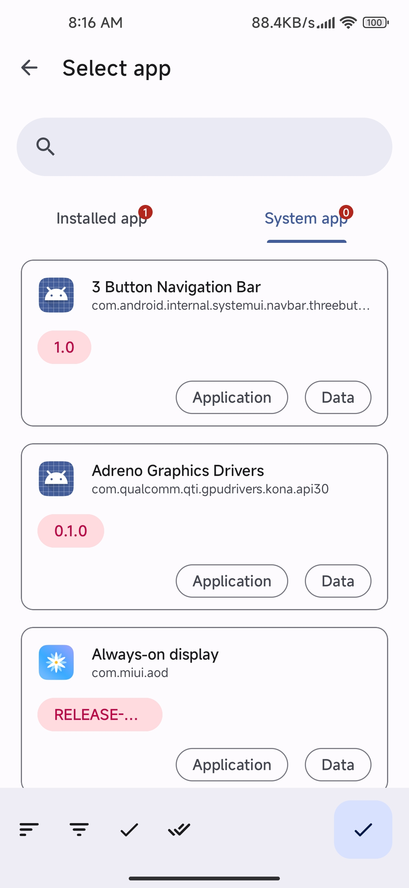
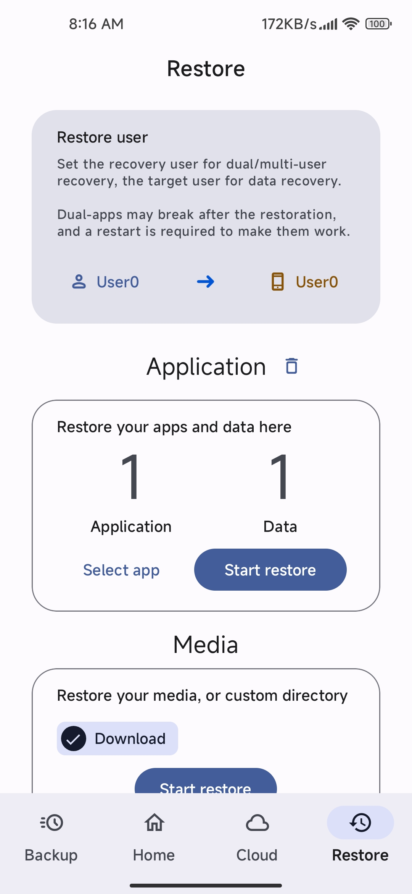
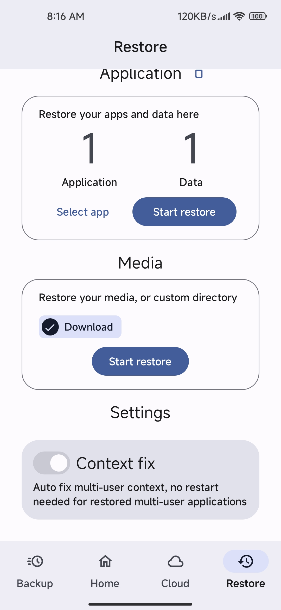

	 简体中文 | <a href=README_TW.md> 繁体中文 </a> | <a href=README_EN.md> English </a> | <a href=README_RU.md> Russian </a> | <a href=README_UK.md> Ukrainian </a> 

# 数据备份
 

> 基于 [酷安@落叶凄凉TEL](http://www.coolapk.com/u/2277637) 制作的[脚本](https://github.com/YAWAsau/backup_script)
>

## 概述
**数据备份脚本**由原作者创作至今**广受好评**，**备份/恢复**数据**高效**且**齐全**。因此经由作者**同意**后**基于此脚本**制作了本**APP**。

## 优势
* **支持多用户/双开备份**：甚至能够跨分区备份/恢复！

* **云端备份**：完整支持Rclone，可实现各类服务提供商网盘本地挂载。

* **数据完整**：在更换系统之后，原有的数据全部保留，无需重新登陆或者下载额外数据包。

* **功能强**：支持Split Apk，支持Arm32, Arm64, x86, x86_64，支持Android9+

* **速度快**：目前支持的压缩算法有 tar lz4 zstd(默认)

* **易操作**：仅需简单几步即可备份App完整数据！

## 截图

	
	
	

## 获取

或者从 [Releases](https://github.com/XayahSuSuSu/Android-DataBackup/releases/latest) 下载

## 开源证书
[GNU General Public License v3.0](./LICENSE)
