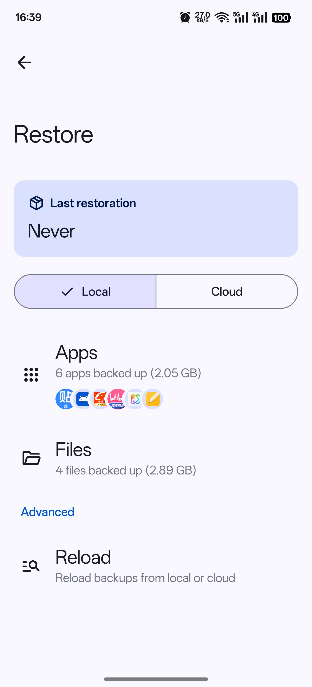

 <a> English </a> 

<h1 align="center">DataBackup</h1>

Free and open-source data backup application

## Overview

:star: Based on [speed-backup](https://github.com/YAWAsau/backup_script) by [CoolApk@落叶凄凉TEL](http://www.coolapk.com/u/2277637).

:fire: The [script](https://github.com/YAWAsau/backup_script) has been **acclaimed** since the [author](https://github.com/YAWAsau) wrote it.

:sparkling_heart: This application was born **with the consent of the author**.

## Usage
See [documentation](https://DataBackupOfficial.github.io).

## Features
* :deciduous_tree: **Root needed, support [Magisk](https://github.com/topjohnwu/Magisk), [KernelSU](https://github.com/tiann/KernelSU), [APatch](https://github.com/bmax121/APatch)**

* :cyclone: **Multi-user Support**

* :cloud: **Cloud**

* :sunglasses: **100% Data Integrity**

* :zap: **Fast**

* :sunny: **Easy**

* :rose: **...**

## Screenshot

	
	

## Download

or get the APK from the [Releases](https://github.com/XayahSuSuSu/Android-DataBackup/releases/latest).

## Translation

## Contributors
Thanks to all these wonderful people!

## Support
If you enjoy this app and want to help it become better, feel free to sponsor me!

## LICENSE
[GNU General Public License v3.0](./LICENSE)
