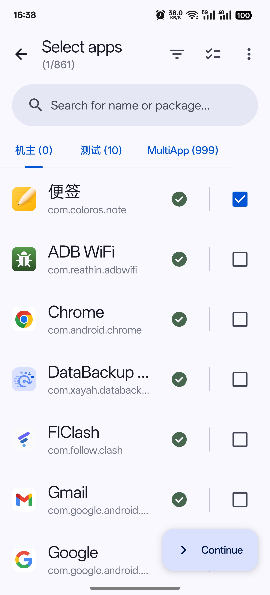
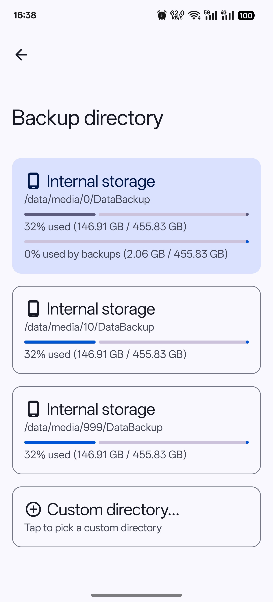

	 <a href=README_zh-rCN.md> 简体中文 </a> | <a href=README_zh-rTW.md> 繁体中文 </a> | English | <a href=README_ru.md> Russian </a> | <a href=README_uk.md> Ukrainian </a> 

# DataBackup
  

> Based on [speed-backup](https://github.com/YAWAsau/backup_script) by [CoolApk@落叶凄凉TEL](http://www.coolapk.com/u/2277637)
>

## Overview
The script has been **widely acclaimed** since the author made it. This app was made **with the consent of the author**.

## Advantage
* **Support multi-user/dual backup**: Even backup/restore across partitions!

* **Cloud**: Fully supports Rclone, which can realize local mounting of network disks of various service providers.

* **100% Data Integrity**: All the data will be retained, and there is no need to log in again or download additional packages.

* **Full**: Split Apk, Arm32, Arm64, x86, x86_64, Android9+.

* **Fast**: Support: tar lz4 **zstd(default)**.

* **Easy**: Just a few simple steps!

## Screenshot

	
	

## Download

or get the APK from the [Releases](https://github.com/XayahSuSuSu/Android-DataBackup/releases/latest).

## Translation

## LICENSE
[GNU General Public License v3.0](./LICENSE)
