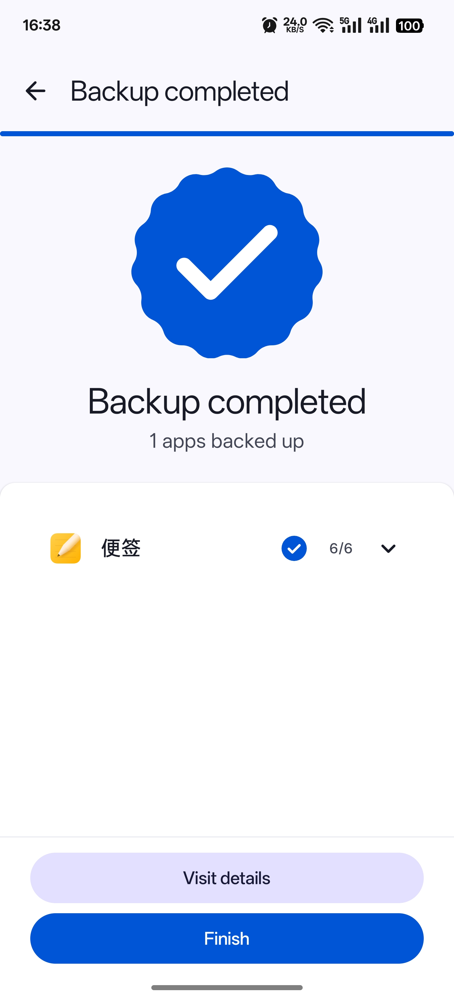

# DataBackup
 

> На основі [backup_script](https://github.com/YAWAsau/backup_script) від розробника [CoolApk@落叶凄凉TEL](http://www.coolapk.com/u/2277637)
>

## Огляд
Скрипт отримав **широке визнання** відтоді, як його створив автор. Цей додаток створено **за згодою автора**.

## Переваги
* **Підтримка багатокористувацького/подвійного бекапу**: навіть резервне копіювання/відновлення між розділами!

* **Хмара**: повністю підтримує Rclone, який може реалізувати локальне монтування мережевих дисків різних постачальників послуг.

* **100% цілісність даних**: усі дані будуть збережені, без необхідності повторно входити в систему чи завантажувати додаткові пакети.

* **Повний**: Split Apk, Arm32, Arm64, x86, x86_64, Android9+.

* **Швидко**: Підтримка: tar lz4 **zstd(за замовчуванням)**.

* **Легко**: всього кілька простих кроків!

## Скріншот

	
	
	

## Завантажити

або отримайте файл .apk із [Розділу релізів](https://github.com/XayahSuSuSu/Android-DataBackup/releases/latest).

## ЛІЦЕНЗІЯ
[GNU General Public License v3.0](./LICENSE)