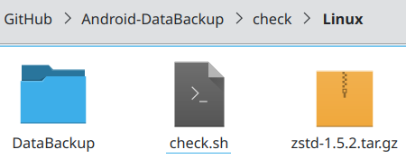
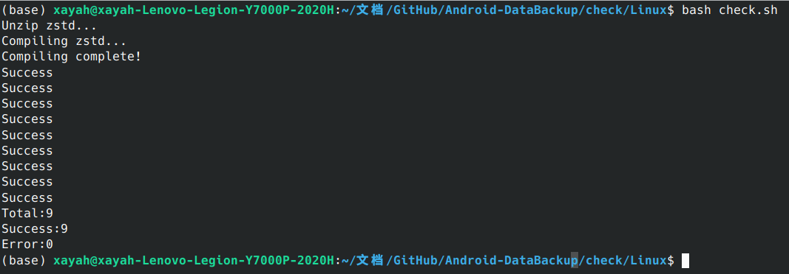
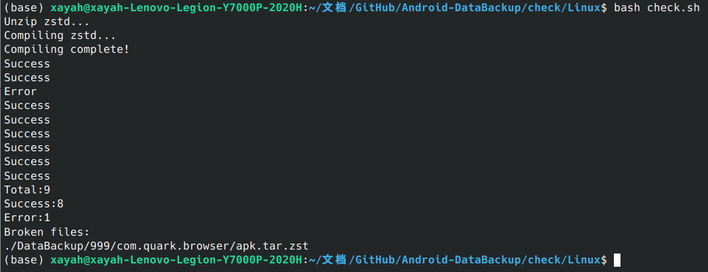

<div align="center">
	<span style="font-weight: bold"> 中文 </span>
</div>

# 数据备份 - 备份校验
## 使用
### 1. 将备份文件夹移动至对应平台的目录下。


### 2. 运行校验脚本
#### Windows平台
双击运行`check.bat`脚本

#### Linux平台
安装make
```
sudo apt-get install make
```
运行`check.sh`脚本
```
bash check.sh
```

### 3. 检验备份
如果未检验到异常，则输出相同的`Total`与`Success`数


如果校验到异常备份，则输出异常备份的位置
